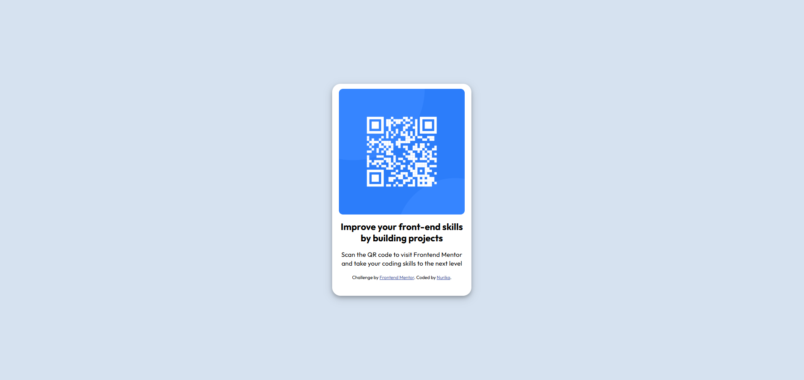

# Frontend Mentor - QR code component solution

This is a solution to the [QR code component challenge on Frontend Mentor](https://www.frontendmentor.io/challenges/qr-code-component-iux_sIO_H). Frontend Mentor challenges help you improve your coding skills by building realistic projects. 

## Table of contents

- [Overview](#overview)
  - [Screenshot](#screenshot)
  - [Links](#links)
- [My process](#my-process)
  - [Built with](#built-with)
  - [What I learned](#what-i-learned)
  - [Continued development](#continued-development)
  - [Useful resources](#useful-resources)
- [Author](#author)
- [Acknowledgments](#acknowledgments)

## Overview

QR code component made with HTML and CSS.

### Screenshot

### Links

- Solution URL: [Add solution URL here](https://your-solution-url.com)
- Live Site URL: [Add live site URL here](https://your-live-site-url.com)

## My process

I write the basic structure of the web using HTML and then styled it using CSS. This challenge is supposed to be the "easiest" one on the page but since i don't have any experience, i had a few confusion while working on it. Especially when I try to positioning the container in the viewport. Also I'm still not used to make any design to be responsive.

### Built with

- Semantic HTML5 markup
- CSS custom properties
- Flexbox

### What I learned

I learned how to use flex box on multiple occasions. Responsive design is one of my weakness so through this challenge i tried my best to implement it. 

I tried my best to use rems and vh instead of px (rem still confuses me every time).

I also had a hard time using flex box. Sometimes I'm still confused between justify-content and justify-items. 
I was trying to put the element in the center horizontally and vertically. I successfully center it horizontally, but for some reason, it sticks on top of the document. Then after some googling anf trial and error, i ended up wrapping the container in another container, set the height to 100 vh, then set the display to flex. After that I can finally center it not only horizontally but also vertically.

Another thing that I'm still not comfortable yet is adding box shadow to a container. 

### Continued development

After this challenge, I will focus my learning on responsive design and flex box (also CSS grid). I really want to be comfortable using them for future design. I'm sure it will be so much fun to code after I fully understand all of that.

### Useful resources

- [Flex Box Container](https://www.w3schools.com/css/css3_flexbox_container.asp) - This helped me to fix my container positioning  using flex box.
- [Box Shadow](https://www.w3schools.com/css/css3_shadows_box.asp) - This helped me to understand how to add a box shadow.

## Author

- Github - [Nurika Ramadhani](https://github.com/nunu114)
- Frontend Mentor - [@nunu114](https://www.frontendmentor.io/profile/nunu114)

## Acknowledgments

Thank you so much for w3schools. Their documentations always helped when I have any doubts in my code.
